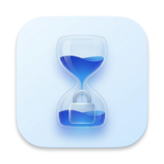
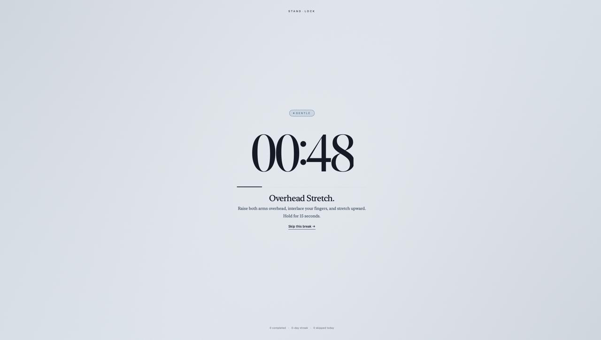
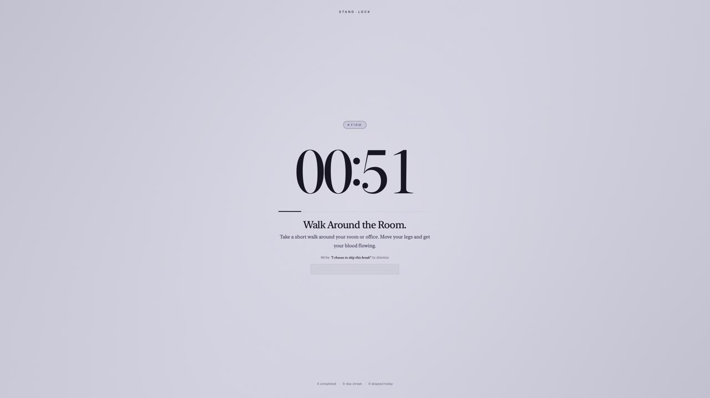
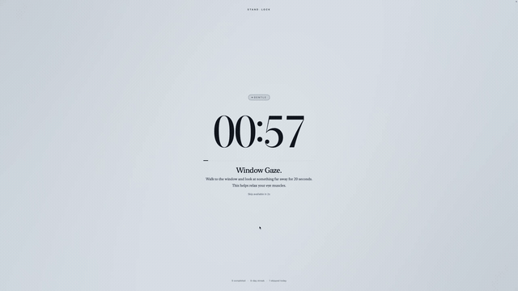
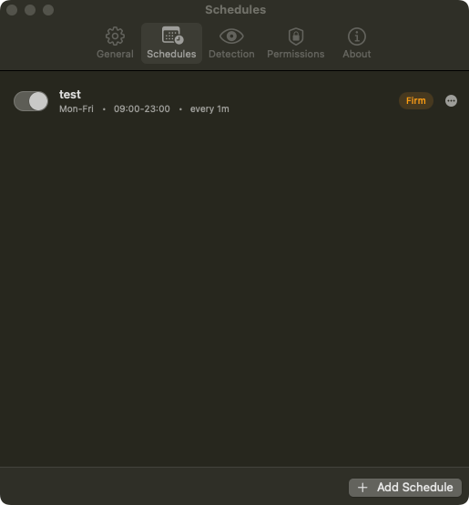
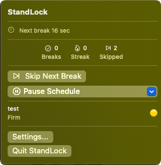

<div align="center">



# StandLock

**A macOS menu bar app that locks your screen until you stand up.**

[](https://github.com/yagizdo/StandLock/releases)
[](https://github.com/yagizdo/standlock/actions/workflows/release.yml)
[](https://github.com/yagizdo/StandLock/releases/latest)
[](https://github.com/yagizdo/homebrew-tap)
[](LICENSE)
[](https://standlock.app?ref=github-readme)
[](https://buymeacoffee.com/yagizdo)



</div>

A macOS menu bar app that forces you to take stand-up breaks. It runs quietly in your menu bar, manages multiple schedules, and puts a full-screen overlay on every display when it's time. You pick how strict each schedule should be, and the app gets progressively harder to dismiss the more you skip.

## Contents

- [Why](#why)
- [Features](#features)
  - [Discipline Levels](#discipline-levels)
  - [Escalation](#escalation)
  - [Smart Scheduling](#smart-scheduling)
  - [Context Awareness](#context-awareness)
  - [Break Experience](#break-experience)
  - [Break Statistics](#break-statistics)
  - [Menu Bar](#menu-bar)
  - [General](#general)
- [Install](#install)
  - [Requirements](#requirements)
  - [GitHub Releases](#github-releases)
  - [Homebrew](#homebrew)
- [macOS Permissions](#macos-permissions)
- [Building from Source](#building-from-source)
  - [Deployment Target](#deployment-target)
- [License](#license)

## Why

Most break reminder apps show a notification you can swipe away in half a second. That doesn't work if you're deep in focus and keep ignoring it. StandLock takes a different approach: instead of asking nicely, it can actually block your screen. You choose the level of enforcement per schedule. Use Gentle mode during casual browsing and Strict mode during long coding sessions. The goal is to make skipping a break a conscious decision, not a reflex.

## Features

### Discipline Levels

Each schedule has its own discipline level. Pick one per schedule and change it anytime.

| Level | Behavior |
|-------|----------|
| Gentle | Full-screen overlay with an immediate skip button |
| Firm | Timed skip delay + type an escape phrase to dismiss |
| Strict | Full input blocking, only an emergency key combo (Ctrl+Option+Command hold) exits |



### Escalation

Enable progressive enforcement on any schedule and each consecutive skip makes the next break harder to dismiss. Challenges range from dodging buttons and mini-games to typing embarrassing phrases with snarky app commentary. Complete a break (or let idle detection count one) and the tier resets.



### Smart Scheduling

- Multiple named schedules, each with its own discipline level and settings
- Time windows (e.g., 09:00-12:00, 13:00-17:00)
- Day selection: weekdays, weekends, every day, or custom
- Pomodoro-style repetition cycles with short/long break patterns
- Alternating work intervals: a schedule can cycle through up to 6 intervals instead of one (e.g. 58 min sitting, then 28 min standing), each with an optional label the break screen shows as what's coming next
- Configurable daily skip limits per discipline level, set in Settings › General (Strict has none)



### Context Awareness

- Defers breaks during meetings (camera/microphone active) or screen sharing
- Integrates with Calendar to skip during upcoming events
- Detects idle time: if you've already been away long enough, the break counts as completed
- Each detection can be set to defer the break, reduce to Gentle, or ignore it entirely

### Break Experience

- Full-screen overlay on every display with countdown timer
- Exercise suggestions during breaks (stretches, water reminders, squats)
- Pauses system media during breaks

### Break Statistics

A dedicated Statistics tab in Settings tracks break history over time.

- 6 metric cards: completions, skips, completion rate, current streak, best streak, total break time
- Week view with per-day cards, month calendar, and year heatmap
- Filtered by period: today, this week, this month, this year

### Menu Bar

- Timer showing remaining time until next break (always-on or last-minutes countdown)
- Break stats: completions, streak, and skips for today
- Pause/resume controls



### General

- **Launch at login** via macOS login items
- **Auto-update** via Sparkle, with an update banner in the menu bar. Off by default: turn on Automatic Updates in Settings and StandLock checks every 4 hours, otherwise use Check for Updates

## Install

### Requirements

- macOS 13+ (Ventura)

### GitHub Releases

Download the DMG: <https://github.com/yagizdo/StandLock/releases/latest>

Drag StandLock to your Applications folder, then open it. The app appears in your menu bar.

### Homebrew

```bash
brew install --cask yagizdo/tap/standlock
```

## macOS Permissions

StandLock requests only the permissions it needs, and only when you use a feature that requires them.

| Permission | Why |
|------------|-----|
| **Accessibility** | Required for Strict mode. Blocks keyboard and mouse input during breaks by installing a system-level event tap. Without this, Strict mode cannot enforce breaks. |
| **Input Monitoring** | Required for Strict mode (alongside Accessibility). Also lets StandLock detect idle time accurately so it won't interrupt you right after you've already been away from the keyboard. |
| **Calendar** | Optional. Reads your calendar events to automatically defer breaks during meetings. Never modifies your calendar. |
| **Camera & Microphone** | Not accessed directly. StandLock checks whether another app is using the camera or mic to detect active meetings and defer breaks accordingly. |

You can revoke any permission at any time in **System Settings > Privacy & Security**. When a permission is revoked, features that depend on it degrade instead of breaking: Strict schedules run as Firm until the permission is back, keeping their Strict setting and showing the reason in the schedule list; idle detection turns off; and calendar integration is skipped. No crashes, no broken state.

## Building from Source

```bash
git clone https://github.com/yagizdo/StandLock.git
cd StandLock
xcodegen generate   # required after pulling -- regenerates StandLock.xcodeproj from project.yml
open StandLock.xcodeproj
```

Build and run the `StandLock` scheme in Xcode. The app lives in your menu bar.

### Deployment Target

The minimum macOS version is declared in four places, and they do not derive from each other:

- `project.yml` -- app target (Xcode project is regenerated from this with `xcodegen generate`)
- `StandLockKit/Package.swift` -- Swift package (separate platform list)
- `scripts/generate-appcast.sh` -- `sparkle:minimumSystemVersion`, decides which installs Sparkle offers the update to
- `scripts/update-homebrew-cask.sh` -- `depends_on macos:`, decides who `brew install` lets in

When raising or lowering the deployment target, update all four and run `xcodegen generate` to refresh `StandLock.xcodeproj`. Direct edits to `StandLock.xcodeproj/project.pbxproj` are overwritten on the next regeneration.

The last two are easy to miss because nothing fails when they are wrong: the build succeeds, and users on the excluded versions are simply never offered the app. That is how 0.3.0 shipped telling Sparkle and Homebrew it needed macOS 15 while the binary reported `minos 13.0`.

## License

MIT · Yilmaz Yagiz Dokumaci ([yagizdo](https://x.com/yagizdo))
